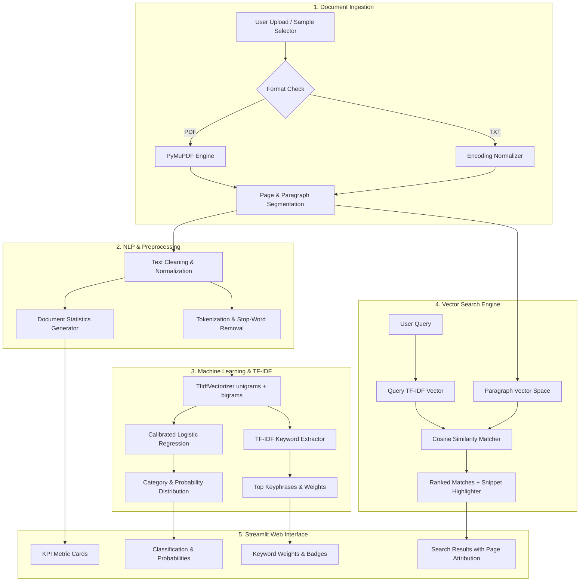

# Intelligent Document Analyzer

An end-to-end, portfolio-grade AI/ML document intelligence platform engineered in Python. It demonstrates production-level text processing, mathematical Natural Language Processing (NLP), supervised machine learning classification, and vector space semantic document retrieval—all without external LLM API wrappers.

---

## 🌟 Key Features

- **Multi-Format Ingestion**: Extracts text, metadata, and page layouts from **PDF** and **TXT** files using high-performance C-bindings via **PyMuPDF** (`pymupdf`).
- **Resilient Error Handling**: Gracefully handles corrupt PDFs, password protection, scanned image-only documents, empty files, and large multi-hundred-page documents.
- **Document Statistics & Lexical Profiling**: Computes word counts, unique vocabulary, character metrics, paragraphs, sentences, estimated reading time, and **Lexical Diversity (Type-Token Ratio / TTR)**.
- **Traditional Machine Learning Classification**: Multi-class classification across 6 categories (`Technology`, `Business`, `Education`, `Finance`, `Sports`, `News`) using a calibrated Scikit-learn pipeline with genuine train/test split metrics.
- **Salient TF-IDF Keyword Extraction**: Extracts top unigram and bigram keyphrases with normalized mathematical TF-IDF scores and term frequency counts.
- **In-Document Vector Search (Cosine Similarity)**: Converts user queries into TF-IDF coordinates and computes cosine similarity angles against indexed document sections/paragraphs, displaying relevance scores and highlighted text snippets with page tracking.
- **Modern Interactive Dashboard**: Professional Streamlit user interface with KPI cards, probability distribution charts, keyword weight visualizations, and a model evaluation inspector.
- **One-Click Sample Documents**: Built-in sample documents (PDF and TXT) across technology, finance, and sports for instant exploration without uploading.

---

## 🏗️ System Architecture



---

## 🔬 How the NLP Pipeline Works

The application operates as a deterministic, mathematically grounded NLP pipeline:

1. **Text Normalization**: Strips control characters, normalizes non-standard Unicode quotes (`“`, `”`, `’`) and dashes (`—`, `–`), unifies carriage returns (`\r\n` $\rightarrow$ `\n`), and standardizes inter-word whitespace.
2. **Boundary Segmentation**: Uses regex-based sentence boundary disambiguation and double-newline paragraph splitting to segment text into discrete semantic chunks while retaining page indices.
3. **Tokenization**: Extracts alphanumeric tokens with optional internal hyphens (e.g., `state-of-the-art`), converting text to lowercase.
4. **Stop-Word Removal**: Employs a comprehensive 150+ English stop-word lexicon, filtering non-informative functional words (`the`, `with`, `because`, `which`) while preserving technical domain terms.
5. **Document Metrics**:
   $$\text{Lexical Diversity (TTR)} = \left(\frac{\text{Unique Word Count}}{\text{Total Word Count}}\right) \times 100\%$$
   $$\text{Reading Time} = \frac{\text{Word Count}}{200\text{ WPM}}$$

---

## 🧠 How the Machine Learning Classifier Works

### Vector Space Representation (TF-IDF)
Raw text is projected into a high-dimensional Euclidean space using **Term Frequency-Inverse Document Frequency (TF-IDF)** with unigrams and bigrams:

$$\text{TF}(t, d) = 1 + \log(\text{count}(t, d)) \quad \text{for count} > 0$$

$$\text{IDF}(t, D) = \log\left(\frac{1 + |D|}{1 + |\{d \in D : t \in d\}|}\right) + 1$$

$$\text{TF-IDF}(t, d, D) = \text{TF}(t, d) \times \text{IDF}(t, D)$$

Sublinear term frequency scaling is enabled (`sublinear_tf=True`) to prevent repeated words from dominating the feature vector.

### Supervised Classification
A multi-class **Logistic Regression** model ($L_2$ penalty, $C=4.0$, L-BFGS solver) learns hyperplanes separating the 6 classes:
- **Technology** (AI, GPU clusters, cloud architectures, MLOps, quantum computing)
- **Business** (strategy, supply chain, B2B marketing, venture capital, corporate governance)
- **Education** (pedagogy, STEM curricula, distance learning, academic research, assessments)
- **Finance** (capital markets, monetary policy, equity valuation, debt dynamics, risk modeling)
- **Sports** (sports science, periodization, tournament tactics, biomechanics, sports psychology)
- **News** (diplomacy, investigative reporting, severe meteorology, elections, public health)

### Model Evaluation on Held-Out Test Split (20%)
The model was evaluated using a stratified 80/20 train/test split:

| Metric | Score | Percentage |
| :--- | :--- | :--- |
| **Accuracy** | `0.8667` | **86.7%** |
| **Macro Precision** | `0.9028` | **90.3%** |
| **Macro Recall** | `0.8611` | **86.1%** |
| **Macro F1-Score** | `0.8651` | **86.5%** |
| **Weighted F1-Score** | `0.8603` | **86.0%** |

#### Class Breakdown
- **Technology**: Precision `1.00`, Recall `1.00`, F1 `1.00`
- **Sports**: Precision `1.00`, Recall `1.00`, F1 `1.00`
- **Education**: Precision `1.00`, Recall `1.00`, F1 `1.00`
- **News**: Precision `0.75`, Recall `1.00`, F1 `0.86`
- **Finance**: Precision `0.67`, Recall `0.67`, F1 `0.67`
- **Business**: Precision `1.00`, Recall `0.50`, F1 `0.67`

---

## 🔎 How Document Search Works

The search engine implements the **Vector Space Retrieval Model**:

1. Each paragraph or section $S_i$ is extracted along with its corresponding page number.
2. A section-level TF-IDF matrix $\mathbf{M}$ is fitted across all sections.
3. When the user enters a search query $Q$, it is transformed using the identical vector space coordinates into a query vector $\vec{q}$.
4. **Cosine Similarity** measures the geometric angle between the query and each section:
   $$\text{sim}(\vec{q}, \vec{s}_i) = \frac{\vec{q} \cdot \vec{s}_i}{\|\vec{q}\|_2 \|\vec{s}_i\|_2}$$
5. Candidate sections exceeding the user-configurable similarity threshold (default $\ge 0.05$) are ranked in descending order.
6. Matched query tokens inside the returned text are highlighted using `<mark>` tags.

---

## 📁 Project Structure

```text
Document analyzer/
├── app.py                      # Main Streamlit web application
├── requirements.txt            # Production dependencies
├── README.md                   # Technical documentation
│
├── data/
│   └── sample_dataset.csv      # 72 multi-paragraph texts across 6 categories
│
├── models/
│   ├── train_model.py          # Model training, split evaluation & artifact builder
│   └── document_classifier.pkl # Persisted model bundle (classifier, vectorizer, metrics)
│
├── sample_docs/
│   ├── sample_document.pdf     # 3-page executive technical report PDF
│   ├── tech_ai_sample.txt      # Sample AI & cloud architecture document
│   ├── finance_report_sample.txt # Sample capital markets & macroeconomics report
│   └── sports_championship_sample.txt # Sample athletic performance document
│
├── src/
│   ├── __init__.py
│   ├── pdf_processor.py        # PyMuPDF ingestion & page tracker
│   ├── text_preprocessor.py    # Text cleaning, tokenizer & statistics
│   ├── classifier.py           # Classifier inference & probability distribution
│   ├── keyword_extractor.py    # TF-IDF keyword & keyphrase extractor
│   └── document_search.py      # TF-IDF + Cosine similarity search engine
│
└── tests/
    └── test_analyzer.py        # Complete 13-test Pytest suite
```

---

## 🚀 Installation & Local Setup

### 1. Clone the Repository
```bash
git clone <repository-url>
cd "Document analyzer"
```

### 2. Install Dependencies
```bash
python -m pip install -r requirements.txt
```

### 3. (Optional) Retrain the Machine Learning Model
The pre-trained model bundle is included in `models/document_classifier.pkl`. To retrain and print test metrics:
```bash
python models/train_model.py
```

### 4. Run the Pytest Test Suite
```bash
python -m pytest tests/test_analyzer.py -v
```
*Expected output: `13 passed in ~1.2s`*

### 5. Launch the Web Application
```bash
python -m streamlit run app.py
```
Open your browser and navigate to:
```text
http://localhost:8501
```

---

## 💡 Example Walkthrough

1. **Quick Test**: Open the application, go to the left sidebar under **⚡ Quick Test**, and select **`AI & Cloud Architecture (PDF)`**.
2. **Review Metrics**: Observe the KPI cards showing **3 Pages**, **400+ Words**, character breakdown, lexical diversity, and reading time.
3. **Inspect Classification**: See the predicted category **`Technology`** with high model confidence and the class probability bar chart.
4. **Examine Keywords**: Check the **Salient Keywords (TF-IDF)** card to see unigram/bigram keyphrases like `neural`, `vector`, `processing`, and `algorithms`.
5. **Search Document**: In the search bar, type `neural network accelerators` or `cosine similarity` to see the top-matching sections with highlighted keywords, page numbers, and cosine similarity scores.
6. **Inspect Content**: Use the **Document Content & Processing Inspector** tabs to view the formatted text, preprocessed tokens, and page-by-page breakdown.

---

## 🔮 Future Enhancements

- **Named Entity Recognition (NER)**: Add spaCy-based extraction of organizations, persons, locations, and monetary values.
- **Document Summarization**: Add extractive TextRank sentence ranking for automated executive summaries.
- **Export Reports**: Generate downloadable PDF/CSV audit summaries of document statistics and classified insights.
